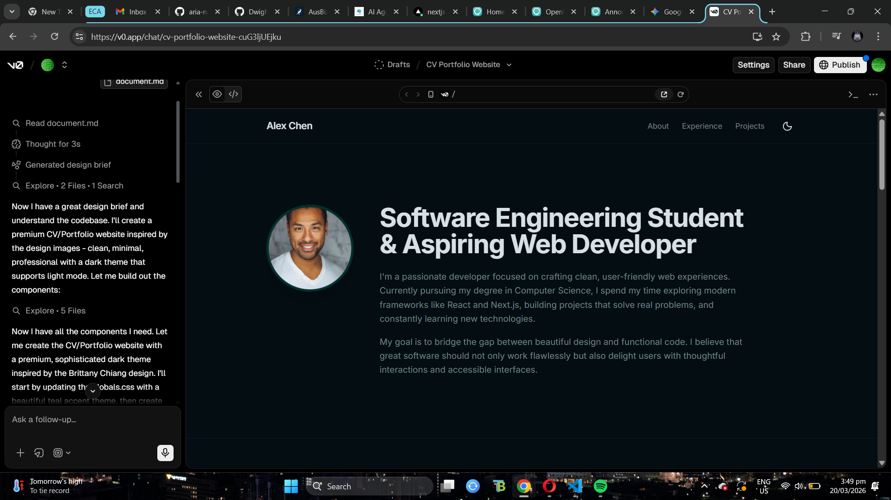
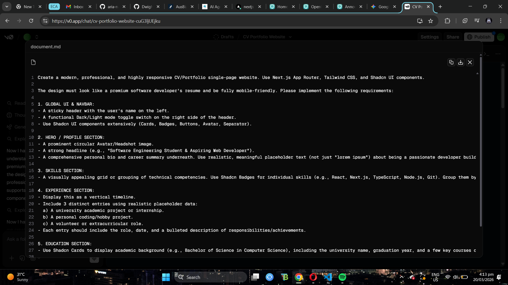
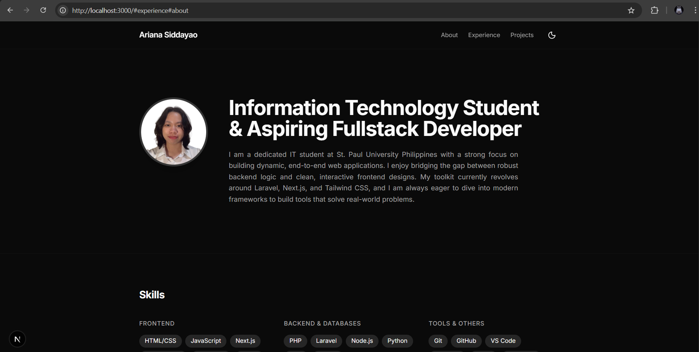
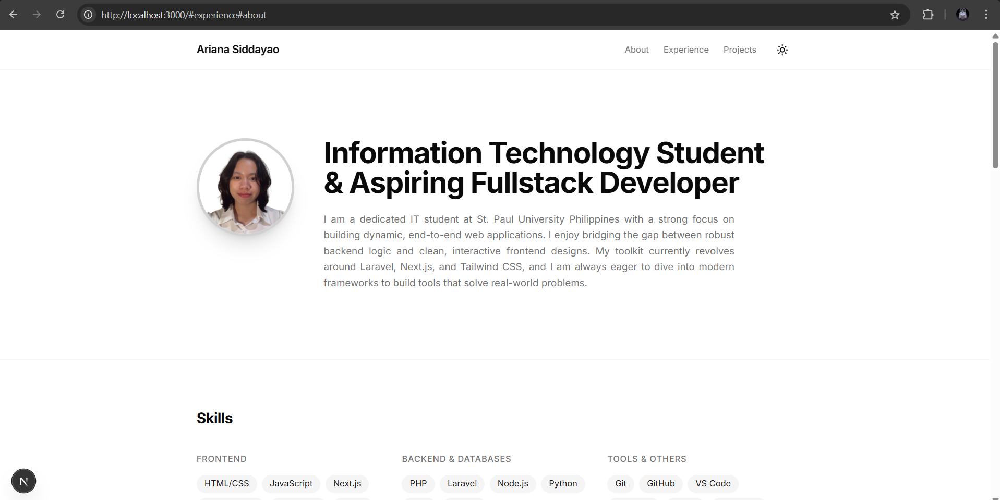

# Personal CV and Interactive Developer Portfolio

A modern, highly responsive developer portfolio built to showcase academic projects, technical skills, and software development growth as an Information Technology student.

## Live Links

- Live Portfolio: https://cv-website-one-bice.vercel.app/
- Repository: https://github.com/aria-na/cv-website.git

## AI Generation Approach

This project was developed using a hybrid workflow: AI-assisted generation for speed and manual engineering for architecture, integration, and quality control.

- UI and Layout Generation (v0.dev):
Core section layouts and reusable interface structure were generated using v0.dev, then adapted into the project component hierarchy.
- Architecture and Integration (LLM Assistance):
AI assistance helped with integration into a modern Next.js App Router codebase, dependency alignment, and debugging issues during setup.
- Debugging and Refactoring:
AI was used to help diagnose missing package issues, adjust Tailwind and component configuration, and refine project structure for maintainability.
- Content Refinement:
AI-assisted drafting was used to convert academic and project experience into concise, professional portfolio wording.

## Features Implemented

- Next.js App Router architecture for scalable page and component structure
- Dark and Light mode toggle with system preference support
- Modular, reusable component sections (Hero, Experience, Projects, Skills, Education, Footer)
- Responsive layout for desktop, tablet, and mobile
- Interactive project cards with repository links
- Radix and Shadcn-inspired UI primitives with accessible patterns

## Tech Stack

- Framework: Next.js, React, TypeScript
- Styling: Tailwind CSS
- UI Components: Radix UI patterns, Shadcn-style components
- Icons: Lucide React
- Theme Management: next-themes
- Deployment: Vercel

## How to Run Locally

1. Clone the repository:

```bash
git clone https://github.com/aria-na/cv-website.git
cd cv-website
```

2. Install dependencies:

```bash
npm install
```

3. Start the development server:

```bash
npm run dev
```

4. Open your browser at:

```text
http://localhost:3000
```

## Production Commands

```bash
npm run build
npm run start
```

## Documentation

### v0.dev Process Screenshot


### v0.dev Prompt Screenshot


### Dark Mode Screenshot


### Light Mode Screenshot


